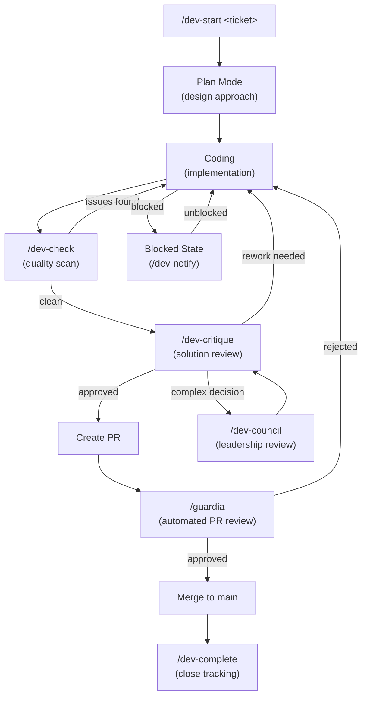
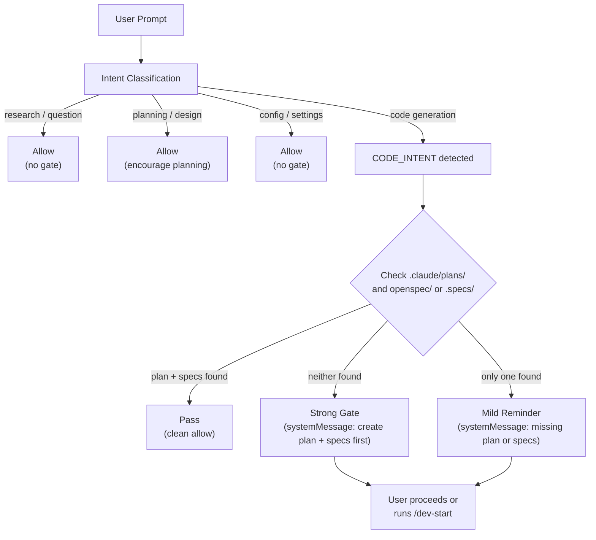
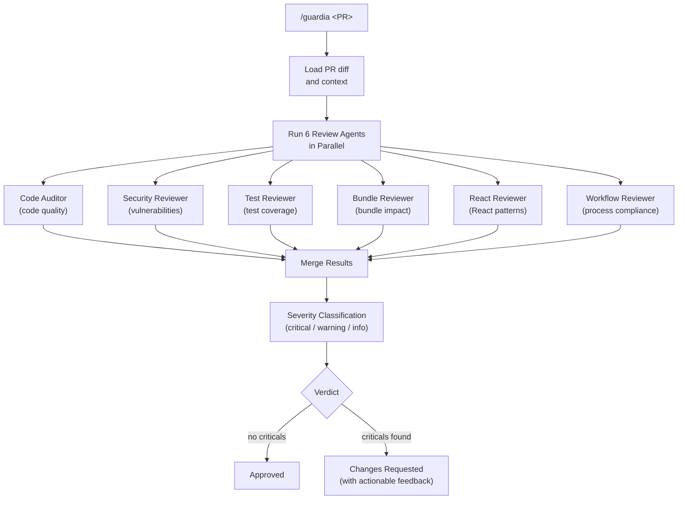
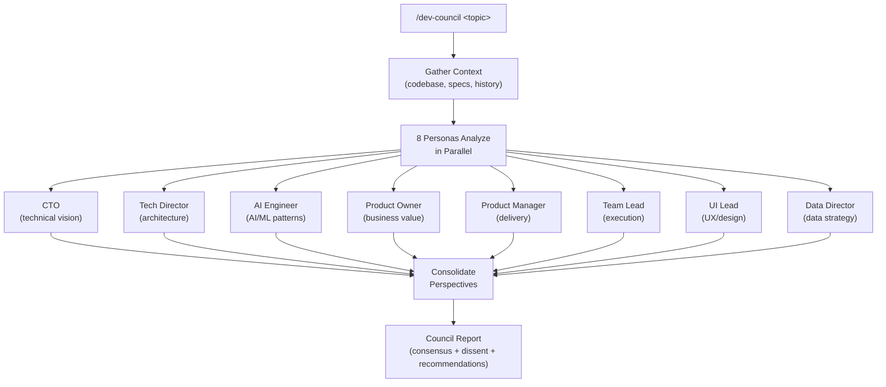
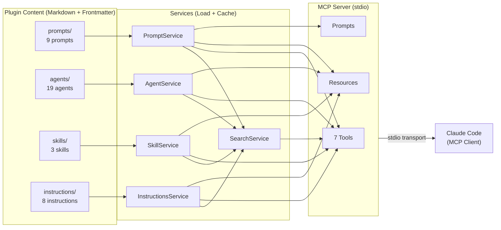
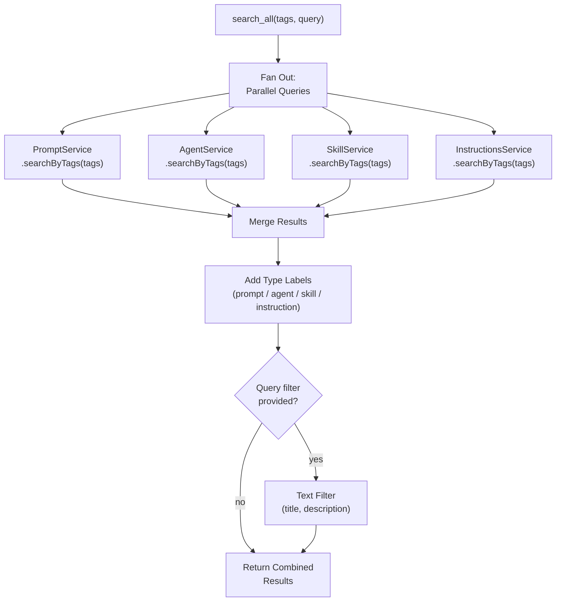

# MODO Dev Framework — Workflow Diagrams

Visual reference for how the framework components connect and interact during development.

---

## 1. Feature Development Lifecycle

- `/dev-start` initializes tracking, loads specs, and sets the development context for a ticket.
- Plan Mode and coding iterate until `/dev-check` confirms quality standards are met.
- `/dev-critique` provides a critical review of the solution before PR creation; complex decisions can escalate to `/dev-council`.
- `/guardia` runs 6 parallel review agents against the PR; failures loop back to coding.
- `/dev-complete` closes the development cycle, updates tracking, and generates a summary.

---

## 2. Spec-First Enforcement Flow

- The `prompt-interceptor` hook fires on every `UserPromptSubmit` event before the LLM processes the request.
- Intent classification uses pattern matching to categorize the prompt (research, planning, config, or code generation).
- Only code-generation intents trigger the spec-first gate; all other intents pass through immediately.
- The gate checks for active plans in `.claude/plans/` and specs in `openspec/` or `.specs/`.
- Enforcement is non-blocking: the decision is always `allow`, but a `systemMessage` is injected to guide the developer.

---

## 3. PR Review Pipeline (/guardia)

- `/guardia` accepts a PR reference and loads the full diff plus repository context.
- Six specialized review agents run in parallel, each focused on a different quality dimension.
- Results from all agents are merged into a unified report with severity levels (critical, warning, info).
- Critical findings block the PR; warnings and info items are reported but do not block.
- Each finding includes actionable feedback pointing to specific files and lines.

---

## 4. Leadership Council (/dev-council)

- `/dev-council` provides multi-perspective analysis for architectural decisions, tech debt trade-offs, or strategic questions.
- Eight leadership personas evaluate the topic concurrently, each from their domain expertise.
- The consolidated report surfaces areas of consensus, points of disagreement, and ranked recommendations.
- This command is designed for high-impact decisions where a single-perspective review would be insufficient.
- The output includes actionable next steps with assigned ownership per persona domain.

---

## 5. MCP Server Architecture

- The MCP server reads markdown files with YAML frontmatter from four content directories: prompts, agents, skills, and instructions.
- Each content type has a dedicated service that handles loading, caching, and tag-based search.
- The `SearchService` aggregates queries across all four services for the `search_all` tool.
- The server exposes 7 tools (search_prompts, get_prompt, search_agents, search_skills, search_instructions, get_instruction, search_all), plus MCP-native Resources and Prompts.
- Communication uses stdio transport, connecting to Claude Code as the MCP client.

---

## 6. Content Discovery Flow (search_all)

- `search_all` is the unified discovery tool that queries across all four content types in a single call.
- Tags use OR logic: any item matching at least one provided tag is included in results.
- Each result is labeled with its content type so the caller can distinguish prompts from agents, skills, and instructions.
- An optional text query further filters results by matching against titles and descriptions.
- This is the recommended entry point when exploring the framework's content without knowing which type to look for.
