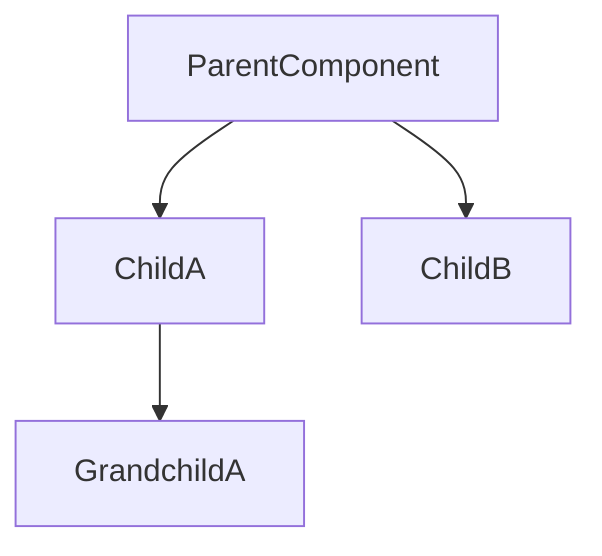
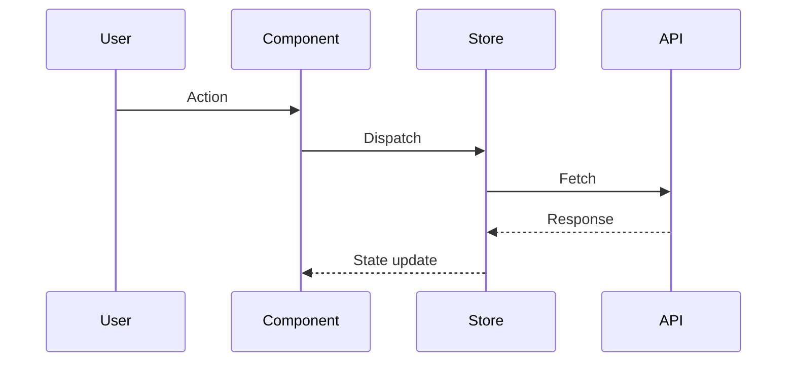
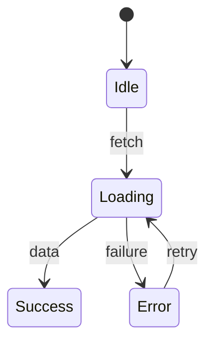
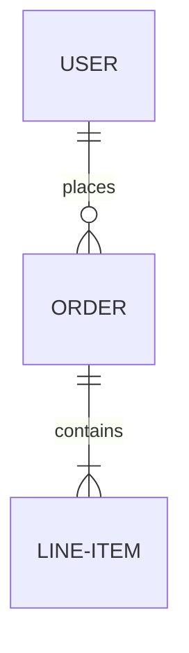

# Documentation Standards

How the framework generates and maintains documentation in the dev-vault.

## Vault File Purposes

| File | Purpose | Updated By | Append-Only |
|------|---------|-----------|-------------|
| journal.md | Day-by-day development log | All commands | Yes |
| acceptance.md | AC checklist with evidence | /dev-check, /dev-complete | No (status updates) |
| architecture.md | Diagrams and technical docs | /dev-critique, /dev-docs | No (regenerated) |
| decisions.md | ADRs for significant choices | /dev-critique, /dev-docs | Yes (new ADRs) |
| review.md | Code review findings | /dev-check, /dev-critique, /guardia | Yes (new entries) |
| summary.md | Final feature summary | /dev-complete | No (final write) |

## Mermaid Diagram Standards

### Component Diagrams


### Sequence Diagrams (Data Flow)


### State Diagrams


### Entity Relationship


## ADR Template

```markdown
## ADR-{ticket}-{NNN}: {Title}

**Status**: Accepted | Superseded | Deprecated
**Date**: {YYYY-MM-DD}
**Context**: {Why this decision was needed}

### Options Considered
1. **{Option A}**: {description} - Pros: {pros} - Cons: {cons}
2. **{Option B}**: {description} - Pros: {pros} - Cons: {cons}

### Decision
{What was decided and why}

### Consequences
- **Positive**: {benefits}
- **Negative**: {tradeoffs}
- **Risks**: {what could go wrong}
```

## Journal Entry Format

```markdown
---

## {YYYY-MM-DD HH:MM} - {Event Type}

### {Context or summary}
- {Key detail}
- {Key detail}

### {Metrics if applicable}
- Quality Score: {N}/100
- AC Progress: {N}%
```

## Quality Score for Documentation

| Dimension | Weight | Criteria |
|-----------|--------|----------|
| Architecture docs present | 25% | Diagrams exist and are current |
| All ADRs documented | 25% | Each significant decision has an ADR |
| ACs fully mapped | 25% | Every AC has implementation evidence |
| Journal complete | 15% | Entries for start, checks, completion |
| Summary readable | 10% | Someone unfamiliar can understand the feature |
