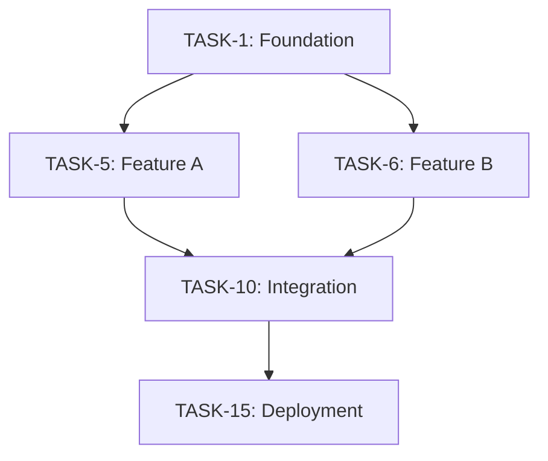

# Sprint Plan: [Project Name]

**Generated**: [Date]
**Total Sprints**: [X]
**Total Story Points**: [X]
**Team Size**: [X] developers

---

## Overview

| Metric | Value |
|--------|-------|
| **Total Tasks** | [X] |
| **Critical Tasks** | [X] 🔴 |
| **Important Tasks** | [X] 🟡 |
| **Minor Tasks** | [X] ⚪ |
| **Estimated Duration** | [X] weeks |

### Complexity Breakdown

| Size | Count | Story Points | % of Total |
|------|-------|--------------|------------|
| XL (5 pts) | [X] | [X] | [X]% |
| L (3 pts) | [X] | [X] | [X]% |
| M (2 pts) | [X] | [X] | [X]% |
| S (1 pt) | [X] | [X] | [X]% |

---

## Sprint 1: Foundation (Week 1)

**Goal**: [High-level sprint goal]

**Story Points**: [X] / [Target]

### Critical Path 🔴

- [ ] **[TASK-1]**: [Task description]
  - **Complexity**: [S/M/L/XL]
  - **Dependencies**: [None | TASK-X]
  - **Owner**: [Name/Unassigned]
  - **Details**: [Additional details]

### High Priority 🟡

- [ ] **[TASK-2]**: [Task description]
  - **Complexity**: [S/M/L/XL]
  - **Dependencies**: [None | TASK-X]

### Medium Priority ⚪

- [ ] **[TASK-3]**: [Task description]
  - **Complexity**: [S/M/L/XL]

### Definition of Done

- [ ] All tasks completed
- [ ] Code reviewed
- [ ] Tests passing
- [ ] Deployed to [environment]

---

## Sprint 2: Features (Week 2)

**Goal**: [High-level sprint goal]

**Story Points**: [X] / [Target]

### Critical Path 🔴

- [ ] **[TASK-X]**: [Task description]
  - **Complexity**: [S/M/L/XL]
  - **Dependencies**: TASK-1 (Sprint 1)

### High Priority 🟡

- [ ] **[TASK-Y]**: [Task description]

### Definition of Done

- [ ] Features functional end-to-end
- [ ] Integration tests passing
- [ ] Documentation updated

---

## Sprint 3: Polish (Week 3)

**Goal**: [High-level sprint goal]

**Story Points**: [X] / [Target]

### Tasks

- [ ] **[TASK-X]**: UI refinement
  - **Complexity**: M
- [ ] **[TASK-Y]**: Error handling
  - **Complexity**: M
- [ ] **[TASK-Z]**: Performance optimization
  - **Complexity**: L

### Definition of Done

- [ ] No critical bugs
- [ ] UI matches design system
- [ ] Performance benchmarks met

---

## Sprint 4: QA & Deploy (Week 4)

**Goal**: [High-level sprint goal]

**Story Points**: [X] / [Target]

### Tasks

- [ ] **[TASK-X]**: End-to-end testing
  - **Complexity**: L
- [ ] **[TASK-Y]**: Documentation
  - **Complexity**: M
- [ ] **[TASK-Z]**: Deployment to production
  - **Complexity**: M

### Definition of Done

- [ ] All tests passing (unit + integration + e2e)
- [ ] Documentation complete
- [ ] Deployed to production
- [ ] Monitoring configured

---

## Dependencies Graph

---

## Risk Assessment

| Risk | Impact | Probability | Mitigation |
|------|--------|-------------|------------|
| [Risk 1] | High | Medium | [Mitigation strategy] |
| [Risk 2] | Medium | Low | [Mitigation strategy] |

---

## Team Allocation

| Sprint | Frontend | Backend | QA | DevOps |
|--------|----------|---------|----|----|
| 1 | [X] tasks | [Y] tasks | - | [Z] tasks |
| 2 | [X] tasks | [Y] tasks | [Z] tasks | - |
| 3 | [X] tasks | - | [Y] tasks | [Z] tasks |
| 4 | - | - | [X] tasks | [Y] tasks |

---

## Milestones

| Milestone | Date | Deliverable |
|-----------|------|-------------|
| **M1**: Foundation Complete | End of Sprint 1 | [Deliverable] |
| **M2**: Features Complete | End of Sprint 2 | [Deliverable] |
| **M3**: Production Ready | End of Sprint 4 | [Deliverable] |

---

## Notes

### Assumptions

* [Assumption 1]
* [Assumption 2]

### Blockers

* [Potential blocker 1]
* [Potential blocker 2]

### Out of Scope

* [Item 1 out of scope]
* [Item 2 out of scope]

---

## Review Cadence

* **Daily Standup**: 10am (15 minutes)
* **Sprint Planning**: Monday Week X (2 hours)
* **Sprint Review**: Friday Week X (1 hour)
* **Sprint Retrospective**: Friday Week X (1 hour)

---

**Created by**: MODO Technical Architect
**Last updated**: [Date]
