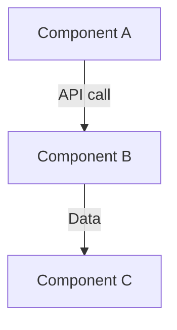

# [Project Name] - Technical Implementation Guide

> **Document consolidado**: PRD + Implementación + APIs + Workflow
> **Última actualización**: [Date]
> **Status**: [X%] completo

---

## 📋 Tabla de Contenidos

1. [Resumen Ejecutivo](#resumen-ejecutivo)
2. [Stack Tecnológico y Dependencias](#stack-tecnológico-y-dependencias)
3. [Arquitectura del Sistema](#arquitectura-del-sistema)
4. [Integración con APIs de MODO](#integración-con-apis-de-modo)
5. [Design System y UI Library](#design-system-y-ui-library)
6. [Tools MCP: Implementados y Faltantes](#tools-mcp-implementados-y-faltantes)
7. [Componentes UI: Inventory y Gaps](#componentes-ui-inventory-y-gaps)
8. [Workflow de Implementación](#workflow-de-implementación)
9. [Glosario de Tecnologías](#glosario-de-tecnologías)
10. [Referencias y Recursos](#referencias-y-recursos)

---

## 1. Resumen Ejecutivo

### Objetivo del Proyecto
[1-2 sentences describing what the project does]

### Estado Actual
- **Arquitectura**: [✅/🟡/❌] [Status description]
- **APIs**: [X/Y] endpoints implementados
- **UI Components**: [X/Y] components implementados
- **Alineación con PRD**: [X/10]

### Gaps Críticos
1. 🔴 [Critical gap 1]
2. 🔴 [Critical gap 2]
3. 🟡 [Important gap 1]

---

## 2. Stack Tecnológico y Dependencias

### 2.1 Dependencias Core

#### Frontend
```json
{
  "react": "^X.X.X",
  "@playsistemico/modo-sdk-web-ui-lib": "^X.X.X",
  ...
}
```

#### Backend
```json
{
  "@modelcontextprotocol/sdk": "^X.X.X",
  ...
}
```

### 2.2 Librerías MODO Oficiales

| Librería | Versión | Uso | Repo |
|----------|---------|-----|------|
| **modo-sdk-web-ui-lib** | X.X.X | UI components | GitHub Packages |

⚠️ **IMPORTANTE**: [Description of official library and how to use it]

### 2.3 Remote Config para Design System

**Archivo**: [path/to/RemoteConfig.tsx]

Variables CSS disponibles:
```css
--color-default: #XXXXXX
--color-yellow-default: #XXXXXX
...
```

---

## 3. Arquitectura del Sistema

### 3.1 Diagrama de Arquitectura



### 3.2 [Additional architecture sections]

---

## 4. Integración con APIs de MODO

### 4.1 [API Name] - Documentación Completa

#### Endpoint Base
```
[METHOD] https://[domain]/[path]
```

#### Parámetros

| Parámetro | Tipo | Obligatorio | Default | Descripción |
|-----------|------|-------------|---------|-------------|
| param_name | string | ✅/❌ | value | Description |

#### Estructura de Respuesta

```typescript
interface Response {
  // Type definition
}
```

#### Campos Faltantes vs PRD

| Campo PRD | Presente en API | Acción |
|-----------|-----------------|--------|
| Field 1 | ✅/❌ | Action needed |

---

## 5. Design System y UI Library

### 5.1 Fuente de Verdad: Remote Config

**⚠️ REGLA**:
- ❌ NO crear variables CSS duplicadas
- ✅ SIEMPRE usar variables de RemoteConfig

### 5.2 Paleta de Colores: PRD vs Implementado

| Token | PRD | Implementado | Variable CSS | Acción |
|-------|-----|--------------|--------------|--------|
| Verde | `#XXXXXX` | `#XXXXXX` | `--color-default` | ✅/🔴 |

---

## 6. Tools MCP: Implementados y Faltantes

### 6.1 Tools Implementados

#### A. `tool_name`

**Ubicación**: [file:line]

**Implementación**:
```typescript
// Implementation details
```

### 6.2 Tools Faltantes (Críticos)

#### B. `missing_tool` 🔴 CRÍTICO

**PRD Especifica**:
```typescript
{
  name: 'tool_name',
  inputSchema: {...}
}
```

**Debe retornar**:
```typescript
// Expected output
```

---

## 7. Componentes UI: Inventory y Gaps

### 7.1 Componentes Implementados

#### A. `ComponentName` ✅

**Ubicación**: [path/to/component]

**Implementación**: [Description]

**Gap**: [Gaps if any]

### 7.2 Componentes Faltantes (Críticos)

#### B. `MissingComponent` 🔴 CRÍTICO

**PRD especifica**: [Description]

**Implementación requerida**: [Details]

---

## 8. Workflow de Implementación

### 8.1 Antes de Codear: Checklist

**⚠️ IMPORTANTE**: Siempre seguir este orden:

#### 1. Consultar UI Library Oficial
- ¿El componente existe?
- ¿Hay similar que se pueda extender?

#### 2. Consultar Remote Config
- ¿Variables CSS disponibles?
- Usar `var(--color-default)`, NO hardcodear

#### 3. Consultar Documentación de APIs
- ¿El endpoint existe?
- ¿Qué parámetros acepta?

---

## 9. Glosario de Tecnologías

### Frontend

| Tecnología | Versión | Uso | Documentación |
|------------|---------|-----|---------------|
| **React** | X.X.X | Framework UI | [link] |

### Backend

| Tecnología | Versión | Uso | Documentación |
|------------|---------|-----|---------------|
| **MCP SDK** | X.X.X | Protocol | [link] |

---

## 10. Referencias y Recursos

### Documentación Interna

| Recurso | Ubicación | Contenido |
|---------|-----------|-----------|
| **PRD Original** | [path] | Requerimientos |

### APIs y Swagger

| API | URL | Acceso |
|-----|-----|--------|
| **[API Name]** | [url] | [access info] |

---

## Apéndice A: Comandos Útiles

```bash
# Development
npm run dev

# Build
npm run build

# Testing
npm run test
```

---

## Apéndice B: Estructura de Carpetas

```
project/
├── src/
│   ├── features/
│   ├── shared/
│   └── types/
├── server/
└── ...
```

---

**Mantenedores**: [Team name]
**Última revisión**: [Date]
**Próxima revisión**: [When]
